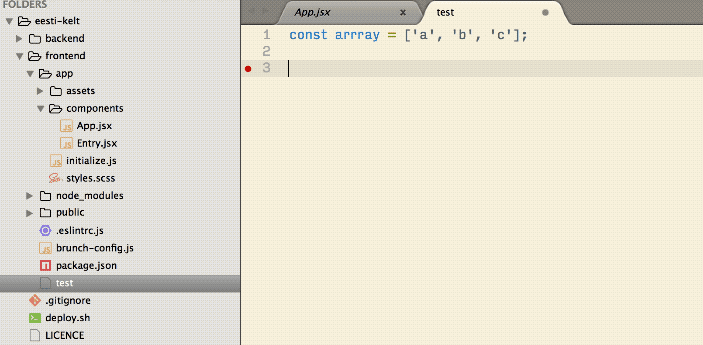

<div align="center">
  
</div>

# Sublime Text 3 Plugins for Frontend Web Development

Sublime is great and for many still the best text editor available. But out of the box, it lacks some features that modern competitors have already built-in. Plugins help to stay ahead but it's a hassle to keep up with all of them. In order to help you, I compiled a list of plugins I use for my daily frontend web development. 

If you know plugins that should be on this list, just open an issue. 😉

This list was shared by (among others):

### Table of Contents
1. [Plugins](#plugins)
	1. [Administrative](#administrative)
	2. [General](#general)
	3. [Javascript](#javascript)
	4. [HTML & CSS](#htmlcss)
	5. [Linter](#linter)
	6. [Other](#other)
2. [Themes](#themes)
3. [Settings](#settings)

<a name="plugins"/>

## 1. Plugins

<a name="administrative"/>

### 🗃 i. Plugins
These plugins are kind of 'meta' because they are not concerned with writing code.

[A File Icon](https://packagecontrol.io/packages/A%20File%20Icon): Add icons to the files in the sidebar.
[Advanced CSV](https://packagecontrol.io/packages/Advanced%20CSV)
[AdvancedNewFile](https://packagecontrol.io/packages/AdvancedNewFile): A better way to create new files. For instance, it automatically creates a folder when needed.
[AlignTab](https://packagecontrol.io/packages/AlignTab): Align your code by `:`, `=`, `=>`, `%`, ` `, `|` or your own RegEx.
[Alignment]
[All Autocomplete](https://packagecontrol.io/packages/All%20Autocomplete): Indexes all open files for auto-completion.
[ApacheConf]
[ApplySyntax]
[ayu](https://packagecontrol.io/packages/ayu)
[BracketHighlighter](https://packagecontrol.io/packages/BracketHighlighter): Improves the already built-in highlighting.
[CSS3](https://packagecontrol.io/packages/CSS3): Replaces the built-in CSS support with a more up-to-date one. Includes [cssnext](http://cssnext.io) support. Follow the instructions to make it work properly.
[Case Conversion]
[CodeComplice]
[Color Highlighter](https://packagecontrol.io/packages/Color%20Highlighter)
[DevSkim]
[Editor Config](https://packagecontrol.io/packages/EditorConfig): Maintain consistent coding styles between different editors.
[Emmet](https://packagecontrol.io/packages/Emmet): Allows you to write HTML very fast. You have to learn their way though.
[FindKeyConflicts](https://packagecontrol.io/packages/FindKeyConflicts): Key conflicts are inevitable when you use a lot of plugins.
[Genesis]
[GitGutter](https://packagecontrol.io/packages/GitGutter): Displays modified lines in the gutter (left to the line numbers).
[GitSavvy](https://packagecontrol.io/packages/GitSavvy): Full git and GitHub integration.
[Git](https://packagecontrol.io/packages/Git): Includes some git commands.
[Gitignore](https://packagecontrol.io/packages/Gitignore): Fetches templates for the .gitignore provided by [Github](https://github.com/github/gitignore).
[HTML Attributes]
[HTML-CSS-JS Prettify]
[HTMLMinifier]
[Line Endings unify]
[Local History](https://packagecontrol.io/packages/Local%20History): Keep a local history of your files.
[Log highlight]
[Markdown Preview](https://packagecontrol.io/packages/Markdown%20Preview)
[PHP Completions Kit]
[PHPIntel]
[php-grammar]
[Package Control](https://packagecontrol.io/packages/Package%20Control): This package enables you to install other packages. Since build 3124, you can install it within Sublime via <em>Tools</em> <em>Install Package Control</em>.
[Package Syncing](https://packagecontrol.io/packages/Package%20Syncing): Keep all you settings, packages etc in sync via Dropbox and co
[ProjectManager](https://packagecontrol.io/packages/ProjectManager): Organizing project files by putting them in a central location.
[SFTP](https://packagecontrol.io/packages/SFTP): Transfer files to a server via FTPS and SFTP. The plugin is like Sublime [Nagware](https://en.wikipedia.org/wiki/Shareware#Nagware). You can use it for free but get a reminder to buy a licence.
[SassSolutions](https://packagecontrol.io/packages/SassSolution): Auto-complete for variables and mixins from your 'settings.scss' file.
[Sass](https://packagecontrol.io/packages/Sass): Sass is a preprocessor extending CSS and this plugins adds the language support.
[SideBarEnhancements](https://packagecontrol.io/packages/SideBarEnhancements): Adds features such as renaming to the sidebar.
[SublimeCodeIntel]
[SublimeLinter]
[SublimeText3Snippets]
[Sync Settings](https://packagecontrol.io/packages/Sync%20Settings): Keep Sublime settings in sync via Github-Gist.
[Terminal](https://packagecontrol.io/packages/Terminal): Open Terminal with current working directory set to the directory of the open file on a hot key.
[Text Pastry](https://packagecontrol.io/packages/Text%20Pastry): Extend the power of multiple selections with features such as incremental numbers and date ranges.
[Theme-Spacegray]
[TodoReview](https://packagecontrol.io/packages/TodoReview): Scans files for `TODO`s and more.
[WPCS Whitelist Flags]
[Whitespace]
[WordPress Completions]
[WordPress Dev]
[WordPress]
[Wordpress Snippets]


<a name="settings"/>

## 3. Settings
```
{
    // Disallows approving auto-complete suggestions with 'enter' to prevent ambiguous situations.
    // You have to get used to it but also Sublime strongly recommends it.
    "auto_complete_commit_on_tab": true,
    "auto_complete_delay": 0,
    // Allow auto-complete suggestion within snippets.
    "auto_complete_with_fields": true,
    "color_scheme": "Packages/Solarized Color Scheme/Solarized (light).tmTheme",
    "create_window_at_startup": false,
    "draw_white_space": "all",
    "ensure_newline_at_eof_on_save": true,
    "font_face": "Input Sans Narrow",
    "font_size": 15,
    "highlight_line": true,
    "ignored_packages":
    [
        "CSS",
        "Vintage"
    ],
    // Highlights the indentation of the current scope.
    "indent_guide_options":
    [
        "draw_normal",
        "draw_active"
    ],
    "indent_to_bracket": true,
    "rulers":
    [
        80
    ],
    "tab_size": 2,
    "translate_tabs_to_spaces": true,
    // NB: the following could lead to a lot of (unnecessary) changes in other's peoples files
    "trim_trailing_white_space_on_save": true,
    "word_wrap": true
}

```
```

{
    "always_show_minimap_viewport": true,
    "animation_enabled": true,
    "auto_close_tags": true,
    "auto_complete": true,
    "auto_complete_commit_on_tab": true,
    "auto_complete_delay": 0,
    "auto_complete_selector": "source, text",
    "auto_complete_with_fields": true,
    "auto_indent": true,
    "auto_match_enabled": true,
    "bold_folder_labels": true,
    "color_scheme": "Packages/ayu/ayu-dark.tmTheme",
    "default_line_ending": "unix",
    "detect_indentation": true,
    "drag_text": false,
    "draw_white_space": "all",
    "ensure_newline_at_eof_on_save": true,
    "fade_fold_buttons": false,
    "find_selected_text": true,
    "font_face": "Source Code Pro",
    "font_options":
    [
        "subpixel_antialias"
    ],
    "font_size": 9,
    "highlight_line": true,
    "highlight_modified_tabs": true,
    "ignored_packages":
    [
        "CSS",
        "Vintage"
    ],
    "indent_guide_options":
    [
        "draw_normal",
        "draw_active"
    ],
    "indent_subsequent_lines": true,
    "index_files": true,
    "match_brackets": false,
    "match_brackets_angle": false,
    "match_brackets_braces": false,
    "match_brackets_content": false,
    "match_brackets_square": false,
    "match_selection": true,
    "match_tags": false,
    "overlay_scroll_bars": "enabled",
    "scroll_past_end": true,
    "show_definitions": true,
    "show_encoding": true,
    "show_line_endings": true,
    "smart_indent": true,
    "spacegray_fileicons": true,
    "spacegray_sidebar_font_normal": true,
    "spacegray_sidebar_tree_normal": true,
    "spacegray_tabs_auto_width": true,
    "spacegray_tabs_font_normal": true,
    "spacegray_tabs_normal": true,
    "tab_completion": true,
    "theme": "Default.sublime-theme",
    "trim_automatic_white_space": true,
    "trim_trailing_white_space_on_save": true,
    "word_wrap": "true"
}

```
